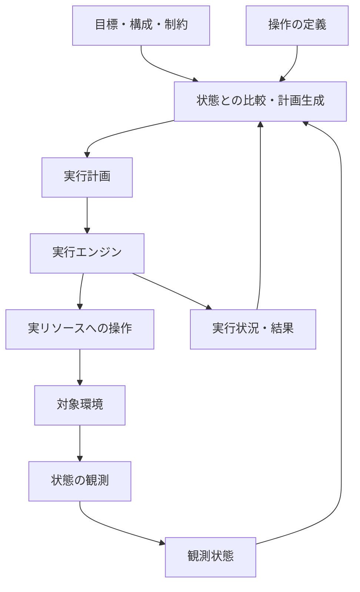

# 最初のAPI＋DB PoC — 構想と実装記録

この文書は最初のAPI＋DB PoC（2026-09-23）の構想・実装記録です。以下の仕様・API・検証内容は当時のものであり、現行実装の仕様ではありません。現在の設計は[アプリ構成と目標からの実行](application-goals.md)、実行方法は[Dockerデモ](demo.md)を参照してください。

記録対象: 2026-09-23時点の最初のPoC

ステータス: 過去の実装記録。Goの計画用モデル、Planner、YAML読み込み、制御ループ、CLIとDocker Runtimeを実装した時点を記録する。

## 背景と目的

Control Planeによる状態の観測・制御と、Workflow / Execution Engineによる操作の実行を組み合わせ、目標と現在の状態から実行計画を導く仕組みを検証する。

初回はAPIとDBからなる一時環境を題材に、既存リソースの再利用と、実行途中の目標変更に応じた再計画を確かめる。汎用的なCI/CD製品の完成ではなく、観測・計画・実行をつなぐ最小のPoCを成果とする。

## コアコンセプト

> 人は構成・目標・制約を定義し、システムが現状から必要な実行計画を導く。

目標を持続的に保持し、状態の観測、計画、実行を繰り返す。実行計画は目標へ近づくために生成・更新される。

ユーザーがパイプラインを事前に記述しなくてもよい、という使い方を目指す。ただし、内部の実行順序や依存関係がなくなるわけではない。操作に関する知識を、前提条件・期待する変化・制約などとしてシステム側へ与える必要がある。

アプリケーションの構成定義だけで、テストの要否やデータ保持方針まで自動的に導けるとは考えない。どこまでを構成・目標・ポリシーとして人が指定するかも設計対象とする。

### 定型パイプラインの生成との違い

定型の手順を生成して一度実行するだけでなく、実行中の状態変化や目標変更に応じて計画を更新する。

例えば、DBがすでに利用可能なら作成を省く。APIの更新がタイムアウトした場合は、実際には更新済みかを観測して次の処理を判断する。

これは目指す設計上の特徴であり、既存製品・研究に対する新規性を確認したという意味ではない。

## 三つの方向性の関係

| 方向性 | 本構想で主に担う部分 |
| --- | --- |
| Generic Control Plane | リソースモデル、状態の観測、継続的な制御 |
| Workflow / Execution Platform | 計画の実行、依存関係、進捗、失敗・再開 |
| 目標へ収束する実行基盤 | 目標から計画を導き、観測と実行をつないで達成へ進める全体 |

Control Planeは全体を包含する呼び方にもなるため、この表は厳密な製品分類ではなく、設計上の関心の整理。

全体の方向として三つ目を据え、前二つの必要な部分を小さく実装する。①②をそれぞれ汎用製品として完成させてから統合する進め方にはしない。

## 論理構成の案



| 部分 | 責務の案 |
| --- | --- |
| 目標・制約のモデル | 何を達成したいか、許容する操作や条件を表現する |
| リソース・観測モデル | 対象の状態と、何が確認できているかを表現する |
| 操作の定義 | 実行の前提条件、期待する変化、実行方法を表現する |
| Planner | 目標と状態から必要な操作を選び、依存関係のある計画を作る |
| Executor | 計画を実行し、進捗・成功・失敗・中断を報告する |
| 制御ループ | 観測・計画・実行を接続し、目標や状態の変化を扱う |

ここでの分割は論理的なもの。別プロセス・別サービス・別リポジトリに分ける決定ではない。

操作の成功報告と、目標状態が実際に成立したことは区別する。テスト成功のような検証結果も、どのバージョンや構成に対して有効かを扱う。現在のDocker Runtimeでは下記の識別情報と照合する。

Plannerは未知の解決方法を発明するものではない。定義された操作や方針で達成できなければ、未達の理由や判断不能な点を示す。

## 最初のPoC — 合意した範囲

2026-09-22に以下の範囲・成功条件で進めることに合意した。実装や環境操作は、技術選定後に具体的な作業計画を示して進める。

### 題材

APIとDBからなる一時環境。

目標の例:

> APIのversion Xと、指定のテストデータ入りDBが利用可能で、その構成に対する結合テストが通っている。

PRごとのプレビュー環境は具体的な応用先の一つ。ただし、PR連携自体を最初のPoCの必須条件には置かない。

### 対象とする操作

- DBの作成
- テストデータの初期化
- APIの起動・更新
- 結合テストの実行
- 環境の削除

削除については、PoCが作成したリソースを終了後に片付ける手段を用意する。目標に基づく削除計画の自動生成までを初回の必須条件にはしない。

### コンセプトを確かめるシナリオ

| シナリオ | 確かめたいこと |
| --- | --- |
| 空の状態から目標を指定する | DB作成・初期化・API起動・結合テストを目標と状態から計画し、実行と観測を通じて達成を確認できる |
| 条件を満たすDBがすでにある | このPoCで作成した初期化済みDBを利用し、作成・初期化を省いた計画を生成できる |
| 作成途中で目標をXからYへ変更する | 以降の計画がYへ向かい、Yに対する結合テスト成功で達成と判定できる |

三つ目が、固定の手順を隠しただけではないことを示す重要な実験になる。実行中の操作は完了を待ち、次の操作の前に最新の目標と観測状態から再計画する。例えばXの起動中にYへ変更した場合、Xの起動完了後に観測し、Yへの更新を計画する。

結合テスト結果は対象バージョン・構成に結び付け、Xに対する成功をYの成功として扱わない。

### 初回の制限と成果

- 単一環境を対象とし、操作は逐次実行する。
- PR連携、分散worker、管理プロセス再起動後の復帰、自動rollback、任意の瞬間の操作キャンセルは初回の対象外。
- アプリが動くことに加え、観測状態、操作を選んだ理由、計画の変化が分かる実行記録を得る。
- PoCが作成したリソースを片付ける手段を用意する。

タイムアウト後の再観測や作成途中の削除要求も有用な検証候補だが、初回の範囲には自動的に追加しない。

### 検証の分け方

- 観測・状態モデル: 対象の現状を正しく表現できるか。
- Planner: 同じ目標でも初期状態に応じた計画ができ、達成できない場合を説明できるか。
- Executor: 計画に従って処理し、その結果を正しく報告できるか。
- 全体: 操作の結果を観測し、目標の達成または未達を判断できるか。

まず小さく一周つながるものを作り、その中の各部分を個別に検証・発展させる。

## PoC後の発展

操作数を増やすだけでなく、性質の違う操作を同じモデルで扱えるかを確かめる。

例えばキューやDNSを追加するとき、操作の前提条件・期待する変化・観測方法を定義すれば既存操作と組み合わせられるかを見る。対象を追加するたびにPlannerへ個別分岐が必要なら、モデルを見直す材料とする。

発展の軸:

- 対象: キュー、DNS、クラウドリソース、異なる実行先。
- 制約: データ保持、停止時間、承認が必要な操作。
- 信頼性: 再起動後の復帰、並行操作の競合、部分失敗、後片付け。

### 複数サービスへの拡張

将来は、複数のマイクロサービスと共有リソースからなるプロダクトも対象にしたい。

最初はAPI＋DBに絞るが、モデルを一つのアプリ専用に固定しない。サービス間の互換性、共有リソースの所有関係、部分更新失敗、計画の分割方法などは将来の論点とする。

操作を追加するだけで対応できるとは限らず、拡張可能性は検証が必要。現時点でそのための仕組みを作り込まない。

## 採用する実装の土台

2026-09-22に以下の構成を採用することに合意した。

| 項目 | 選択 |
| --- | --- |
| 実装言語 | Go 1.26.5 |
| 実行先 | ローカルDocker |
| 操作入口 | CLI＋YAML形式の目標ファイル。CLIで制御ループを起動し、ファイル変更で目標を更新する |
| 本体リポジトリ名 | `goal-executor` |

目標・状態・操作のモデルとDockerを操作・観測する部分を分け、計画の判断をDocker接続なしでも検証できるようにする。

本体リポジトリ `ginoh/goal-executor` は作成済み。詳細設計と実装はこのリポジトリで管理する。Dockerへの実接続・環境操作は、対象と影響を明示した作業計画の承認後に行う。

### 目標ファイルの形式

目標ファイルにはYAMLを採用する。人がコメントを付けて読み書きし、実行途中にも目標を変更する用途を重視する。

JSONはGoの標準ライブラリで扱え、依存を減らせる点から候補にしたが、設計上の必須条件ではない。YAMLをGoの型へ読み込むことで、ファイル形式とPlanner・実行モデルを分離する。ライブラリには `go.yaml.in/yaml/v3 v3.0.5` を採用した。

目標の4項目はすべて必須とし、既定値で補わない。文字列3項目は空白だけの値も拒否し、`requireIntegrationTest`は明示的なbooleanとする。数値から文字列への暗黙変換や`yes`などの文字列からbooleanへの変換は許可しない。未知のキー、重複キー、型不一致、複数ドキュメントはエラーとする。初回は単純なmappingとscalarを扱い、aliasやmergeによる値の参照は対象外。

## 最小モデルと実行方式 — 合意した設計

### データモデル

| モデル | 内容 |
| --- | --- |
| `Goal` | 環境名、APIバージョン、データセット、結合テストの要否 |
| `State` | 観測したDB・APIの状態と、その構成に対する検証結果 |
| `Action` | 操作種別と引数。例: `DeployAPI(version=v2)` |
| `Plan` | 現在の状態から目標へ至る操作列と、その選択理由 |

目標ファイルの例:

```yaml
environment: demo

# 実行中に変更すると、次の操作前に再計画する
apiVersion: v1
dataset: sample-v1
requireIntegrationTest: true
```

DBについては存在・利用可否・データセット、APIについては存在・利用可否・稼働バージョンを扱う。「存在しない」と「観測できない」は区別し、観測失敗を不在として扱わない。

実環境から観測した状態と、Plannerが探索中に仮定する状態は別の値として扱う。予測で観測結果を上書きしない。

テスト成功は対象のAPI・DB構成に結び付ける。Docker RuntimeではAPIとDBのコンテナID・起動時刻、APIバージョン、データセット、初期化時に発行するUUID、データの値を照合する。同じバージョンでも環境の再作成後に以前の成功をそのまま再利用しない。検証結果はメモリ上に保持し、プロセス再起動後は再テストする。

### 操作の知識と実行方法

操作ごとに次の責務を分ける。以下は概念上の名前であり、Goのinterface定義を確定するものではない。

| 責務 | 意味 |
| --- | --- |
| `Applicable(state)` | この状態で実行できるかを判定する |
| `Predict(state)` | 成功した場合の状態を予測する |
| `Execute(context)` | 実際に操作する |

Plannerは前提条件と予測だけを使い、Dockerに接続せずGoの値だけで計画する。操作の定義には成立する条件だけでなく、無効になる情報も含める。

| 操作 | 前提条件 | 期待する変化 |
| --- | --- | --- |
| `CreateDB` | DBが存在しない | DBが利用可能になる |
| `InitializeData(goal.dataset)` | DBが利用可能で、未初期化 | 指定のデータセットが入る |
| `DeployAPI(goal.apiVersion)` | 指定データセット入りDBが利用可能 | 指定バージョンのAPIが利用可能になり、更新前の構成のテスト成功が無効になる |
| `RunIntegrationTest` | 指定のAPI・DBが利用可能 | その構成に対する検証結果が得られる |

表の変化は計画上の予測であり、操作成功の報告だけで実環境の目標達成とは判定しない。実行後に観測し直す。

別のデータセットが入った既存DBの上書き・移行など、定義した操作で扱えない状態は理由付きで未達とする。後片付けは別の手段で提供し、この探索の操作集合には含めない。

### 計画生成

現在の状態から、実行可能な操作を適用した仮の状態を幅優先探索する。

1. 目標を満たすか確認する。
2. 実行可能な操作を列挙し、期待する変化から次の仮の状態を作る。
3. 未訪問の状態を探索し、目標を満たす操作列を返す。

探索対象の操作引数は現在と目標に関係する値に限定する。操作数が最も少ない計画を選び、同数なら一定の操作順で選んで結果を再現可能にする。所要時間やコストの最適化は初回には含めない。

訪問済み状態の比較には、DBの利用可否・データセット・APIバージョン・検証の有効性など、前提条件と達成判定に必要な情報を使う。時刻や実コンテナIDは探索の比較対象から外し、実環境での検証結果の有効性確認に使う。観測状態から探索状態への変換時に、その構成に検証結果が有効かを判定する。

探索上限を設け、結果を次のように区別する。現在の実装は初期状態を含む発見済みの異なる状態数を制限し、既定値は1,000とする。呼び出し時に変更できる。

| 結果 | 意味 |
| --- | --- |
| 達成済み | 操作不要 |
| 計画あり | 次に実行する操作がある |
| 計画なし | 定義済みの操作では到達できない |
| 探索上限 | 上限内では判断できなかった |

### 制御ループと失敗時の扱い

```text
目標ファイルを読む
  → 実環境を観測する
  → 計画を生成・表示する
  → 先頭の1操作を実行する
  → 最初へ戻る
```

計画全体を表示しても、実行するのは先頭の1操作だけとする。完了後に最新の目標と観測状態から再計画する。

実行中に目標が変更されても、その操作に渡した引数は変更せず、完了を待つ。API v1の起動中にv2へ変更した場合、起動完了後の観測からv2への更新・再テストを計画する。

目標達成後も制御ループは待機し、一定間隔で目標と状態を確認する。確認間隔は既定1秒で、`control.Options.Interval`で変更できる。入力エラーによる保留時も同じ間隔で目標を読み直す。

- 操作・観測の失敗時は、理由を示して停止する。無制限の再試行やタイムアウト後の自動復旧は初回に含めない。
- YAMLの読み込み・検証エラー時は、新しい操作の開始を保留する。正しい目標を読み込めたら再開する。未知のフィールドや型の不一致もエラーとする。
- 計画なし・探索上限は達成と区別し、理由を含むエラーを返して制御ループを停止する。
- 単一環境という制限に合わせ、最初の有効な目標の環境名をその実行中は固定する。環境名の変更は入力エラーとして保留し、元の環境名へ修正すれば再開する。

### Docker接続前の検証

最初はモデルとPlannerを実装し、Dockerなしで以下を検証する。その後、Dockerによる観測・操作を接続して合意済みの3シナリオを通して確かめる。

- 空の状態からDB作成・データ初期化・API起動・テストの4操作を導ける。
- 初期化済みDBがあれば作成・初期化を省ける。
- v1からv2への目標変更で更新・再テストを導ける。
- API更新後に古いテスト成功を再利用しない。
- 未対応の状態では、計画なしとして理由を示せる。
- 達成済み・計画なし・探索上限を区別できる。

### 現在の実装と検証結果

`internal/planning` に以下を実装した。このパッケージ自体は標準ライブラリだけを使用する。

| ファイル | 内容 |
| --- | --- |
| `model.go` | `Goal`、比較可能な計画用`State`、`Action`、`Result`、`Options`と入力検証 |
| `action.go` | 4種類の操作の前提条件と予測結果。探索処理から分離した操作定義 |
| `planner.go` | `Plan(goal, state, options) (Result, error)`、幅優先探索、訪問済み状態の除外、操作列の復元 |
| `planner_test.go` | PoCの計画シナリオ、入力・探索上限の境界条件、分岐と循環を含む探索の検証 |

`Result`はステータス、操作列、理由を返す。ステータスは`achieved`、`planned`、`unreachable`、`limit-reached`。操作にも選択理由を持たせる。入力不備はこれらの結果と分けてエラーにする。概念上の`Plan`に相当する操作列は`Result.Actions`として保持する。

計画用`State`はDBの存在・利用可否・データセット、APIの存在・利用可否・バージョン、現在の構成に対する`TestValid`からなる。構造体の値全体を訪問済み状態のキーとして使う。実リソースの識別情報や時刻は含めない。

呼び出し側は、指定環境の観測に成功し、その構成にテスト成功が有効かを照合してから`State`を渡す責務を持つ。Docker Runtimeはコンテナ情報、DB問い合わせ、APIのHTTP応答から観測・照合する。Planner単体のテストでは構成に対応した状態を直接与える。予測によるAPI更新・DB作成・データ初期化では`TestValid`を無効にする。

`Options.MaxStates`は0で既定値、正の値で上限指定、負の値で入力エラーとする。上限を超える新しい状態の追加が必要になった時点で探索を停止し、部分的な操作列は返さない。状態追加が不要な達成済みや探索完了は、上限に達していてもそれぞれ判定できる。

操作候補の順序はDB作成、データ初期化、API起動・更新、結合テストで固定する。この順序は同数の計画の選択順を定めるものであり、操作を実行可能とする依存関係は前提条件から判断する。

`gofmt`適用後、`go test ./...`と`go vet ./...`が成功した。既存の計画シナリオに加え、テスト不要の目標、古い計画の引数を変更しない再計画、探索上限の境界、最短経路・同数時の選択順、循環・自己ループの除外を確認した。

YAML読み込みと制御ループは次のAPIで接続する。

| API | 責務 |
| --- | --- |
| `goalfile.Load(path)` / `goalfile.Decode(reader)` | YAMLの読み込み・検証と`planning.Goal`への変換 |
| `control.LoadGoal` | 目標を読み直す関数。ファイル読み込みなどを差し込む |
| `control.Runtime.Observe(ctx, environment)` | 現状を観測して計画用状態を返す |
| `control.Runtime.Execute(ctx, environment, action)` | 指定操作を完了まで実行する |
| `control.Run(ctx, load, runtime, options)` | 読み込み・観測・計画・1操作の実行を繰り返す |

`control.Options.Report`へ観測状態・計画・操作開始/完了・目標入力エラーを同期的に通知できる。CLIはJSON Linesで出力する。目標変更では実行中の操作の引数を変更しない。終了要求はcontextを通して待機とRuntimeへ伝える。起動したコンテナは残し、所有権を検証する明示的な`cleanup`コマンドで片付ける。

制御ループのテストでは、実際の一時YAMLファイルとテスト用Runtimeを接続した。v1操作の呼び出し中に目標をv2へ変更し、その操作が返った後にv2への更新・テストが実行されること、不正なYAMLの修正後に再開することを確認した。達成後の目標変更、観測・操作失敗、到達不能・探索上限、環境名変更時の保留、待機中の終了も検証した。操作成功だけで観測状態を予測に置き換えないことも確認した。Dockerを含む3シナリオは、明示的に有効化するCLI結合テストで検証する。

## Docker RuntimeとCLIで決めたこと

観測・実行をつなぐ最初の一周は、以下の構成で実装した。当時の実行手順はGit履歴から参照する。現行の`demo.md`はDBなしアプリの手順に更新されている。

1. Goの`os/exec`からDocker CLIを呼び出す。Docker SDKは追加しない。contextは`desktop-linux`に固定する。
2. 実リソースの識別情報はRuntimeが保持し、Plannerへは単純な`State`を渡す。
3. `run --goal FILE`で制御ループを起動する。`--once`で達成時に終了できる。
4. PostgreSQLとGo APIを専用bridge networkに配置する。DBデータはtmpfsに置き、終了後は`cleanup --environment NAME`で所有リソースだけを削除する。
5. 実行記録はJSON Lines、操作単位のタイムアウトは既定90秒とする。操作失敗は停止し、プロセス再起動復帰・自動rollbackは対象外とする。

初回の目標ファイルはYAMLとする。CUEによる検証などの追加利用、永続化方式、汎用provider機構、分散scheduler、AIの利用は未決定。PoCに必要になったものから判断する。

長期的な探索項目や比較対象は[設計上の問い](questions.md)にまとめる。すべてを実装前に解決する必要はない。

## 他候補との関係

PRごとの一時環境基盤は、独立した候補であると同時に本構想の応用先にもなる。

システムシミュレータ、構成探索、アーキテクチャレビュー支援も候補として残す。本構想への関心が強まったことをもって、他候補を不採用にしたとは扱わない。
